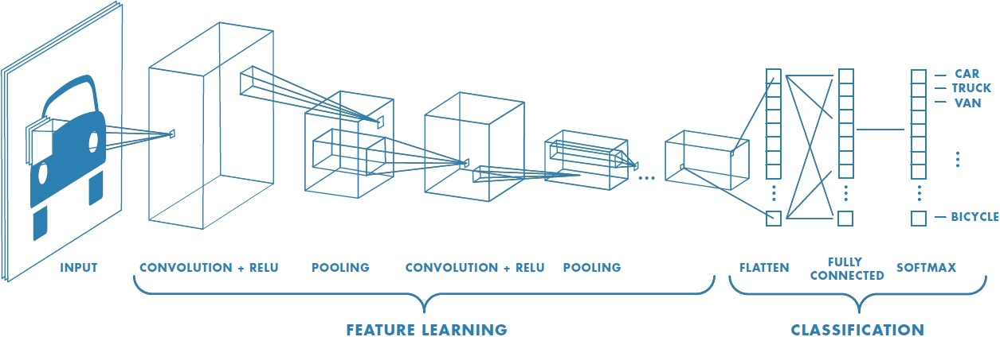
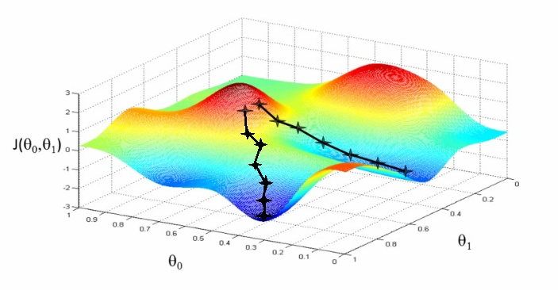

import WmLogo from './src/wm-logo'
export theme from './src/theme';
import { Head, Appear, Notes } from 'mdx-deck';
import { CodeSurfer } from 'mdx-deck-code-surfer';
import nightOwl from 'prism-react-renderer/themes/nightOwl';

<Head>
  <title>ML in the Browser</title>
</Head>

## ML in the Browser
### with Tensorflow.js
 
  <WmLogo/>
 
 

#### Ed Atrero

##### Weedmaps Tech Meetup

---
<h2>Machine Learning</h2>
<Appear>
  <h3>Computer Vision</h3>
  <h4>Image Classification</h4>
</Appear>

<Notes>
  
other CV: object detection, defect detection in manufacturing, autonomous vehicle navigation, military

</Notes>

---
<h1>Demo</h1>

---
<h2>Machine Learning</h2>
  <h3>Computer Vision</h3>
  <h4>Image Classification</h4>
<Appear>
  
Convolutional Neural Network (CNN)

</Appear>

---
<h3>Convolutional Neural Networks</h3>

<Notes>
  
templates (convolutions)

  
classifers (arranged)

  
analog world

  
hardware / algos didn't exist

</Notes>

---

<h3>What is a Convolution?</h3>

<Notes>
  
why? how well does this match w/ my template?

  
what? compute dot product (element by element multiply than sum)

  
same concept used in cellular networks, gps, deep space comm, except your templates are electromagnetic waves

</Notes>
---

<h3>weights</h3>

---
Machine Learning Steps:
<Appear>
  <h1>1. Model</h1>
  <h1>2. Train</h1>
  <h1>3. Predict</h1>
</Appear>

<Notes>

 model usually a NN

 train on labeled data

predict

 rinse wash repeat cycle

</Notes>

---
<h3>Transfer Learning</h3>

<Notes>
  
models take enormous times to optimize (days/weeks on data sets of millions of images)

  
transfer learning

  
 take an existing model

  
freeze feature extraction. keep the weights

  
new classifier. train quickly (minutes/hours).

</Notes>

---
<h1>Tensorflow</h1>

<Appear>
  
Library released by Google Brain team in 2015.

  
Processing multidimensional arrays (tensors)

  
CPUs, GPUs, TPUs

</Appear>

---
<h1>Tensorflow.js</h1>

<Appear>
  
The JS version of tensorflow

  
Uses GPU via WebGL shaders

  
ML portion of the demo in less than 100 lines

</Appear>
---

<h1>Model</h1>

---

<CodeSurfer
  code={require('!raw-loader!./code/model.js')}
  lang="javascript"
  showNumbers={true}
  theme={nightOwl}
  steps={[
    { range: [1, 56] },
    { range: [1, 10] },
    { range: [18, 44] },
    { range: [47, 52] },
  ]}
/>

<Notes>
  
A sequential model is any model where the outputs of one layer are the inputs to the next layer

  
The model topology is a simple 'stack' of layers, with no branching or skipping.

</Notes>

---

<h1>Training</h1>

---
<CodeSurfer
  code={require('!raw-loader!./code/train.js')}
  lang="javascript"
  showNumbers={true}
  theme={nightOwl}
  steps={[
    { range: [1,23] },
    { lines: [13] },
    { lines: [14] },
  ]}
/>

---

<h3> Stochastic Gradient Descent </h3>

<Notes>
  
error function

  
solving for slope is zero

  
closed form solution is hard for higher dimensions

  
as name implies you take random steps, compute error

  
can be computed because you know what the data should be, and the result of your model

  
i.e. i gave my model a picture of a cat, but the model classified it as a dog

  
minimize error function

</Notes>

---

---

<h1>Predict</h1>

---

<CodeSurfer
  code={require('!raw-loader!./code/predict.js')}
  lang="javascript"
  showNumbers={true}
  theme={nightOwl}
  steps={[
    { range: [1, 31] },
    { range: [4, 19] },
    { lines: [8,9,10] },
    { lines: [12,13,14] },
    { lines: [18] },
    { range: [21, 25] },
  ]}
/>

<Notes>
  
tf.tidy cleans up memory when you're done.

</Notes>

---

<Notes>
  
demo

</Notes>

---

<h1>Thanks!</h1>

---

<h1>References</h1>

[https://playground.tensorflow.org/](https://playground.tensorflow.org/)

slides => 

[https://github.com/eatrero/transfer-learning](https://github.com/eatrero/transfer-learning)

