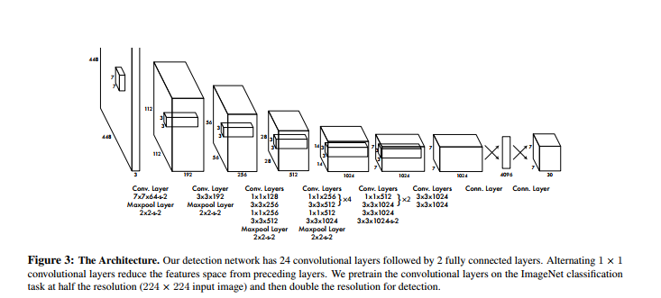

export { future as theme } from 'mdx-deck/themes';
import { Head, Appear, Notes } from 'mdx-deck';
import { CodeSurfer } from 'mdx-deck-code-surfer';
import nightOwl from 'prism-react-renderer/themes/nightOwl';

<Head>
  <title>ML in the Browser</title>
</Head>

## ML in the Browser
### with Tensorflow.js

 
 

#### Ed Atrero

##### Weedmaps Tech Meetup

---
<h1>Demo</h1>

---
<h2>Machine Learning</h2>
<Appear>
  <h3>Computer Vision</h3>
  <h4>Image Classification</h4>
  
Convolutional Neural Network (CNN)

</Appear>

---
<Appear>
  <h1>1. Model</h1>
  <h1>2. Train</h1>
  <h1>3. Predict</h1>
</Appear>

---
<h1>Tensorflow</h1>

<Appear>
  
Library released by Google Brain team in 2015.

  
Processing multidimensional array (like neural networks)

  
CPUs, GPUs, TPUs

  
architecture handles parallel

</Appear>

---
<h3>Convolutional Neural Networks</h3>

<Notes>
convolution 

kernel... looking for spatial coherence
analagous to plaaying with slides

O(n^2 * sizeof(layers) * sizeof(data_set)) = weeks w/ $10k rig of high end cards
</Notes>
---

<h3>convolution</h3>

---

<h3>weights</h3>

---
Transfer Learning

---
<h1>Tensorflow</h1>

<Appear>
  
Library released by Google Brain team in 2015.

  
Processing multidimensional array (like neural networks)

  
CPUs, GPUs, TPUs

</Appear>
---

<CodeSurfer
  code={require('!raw-loader!./code/train.js')}
  lang="javascript"
  showNumbers={true}
  theme={nightOwl}
  steps={[
    { range: [1, 67] },
    { range: [9, 34] },
    { lines: [12] },
  ]}
/>

---

<h1>tf.sequential()</h1>

<Appear>
  
Creates a tf.Sequential model.
 
  
A sequential model is any model where the outputs of one layer are the inputs to the next layer

  
The model topology is a simple 'stack' of layers, with no branching or skipping.

</Appear>

---

<CodeSurfer
  code={require('!raw-loader!./code/train.js')}
  lang="javascript"
  showNumbers={true}
  theme={nightOwl}
  steps={[
    { lines: [12] },
    { lines: [13, 33], notes: "layers" },
    { range: [14,17] },
    { range: [18,24] },
    { range: [25,32] },
    { range: [9,34] },
  ]}
/>

---

---

train

---

<CodeSurfer
  code={require('!raw-loader!./code/train.js')}
  lang="javascript"
  showNumbers={true}
  theme={nightOwl}
  steps={[
    { range: [57, 66] },
  ]}
/>

---

<h3> Stochastic Gradient Descent </h3>

---

---

---
predict

---

references

[mobilenet_v2](https://github.com/tensorflow/models/blob/master/research/slim/nets/mobilenet/mobilenet_v2.py)